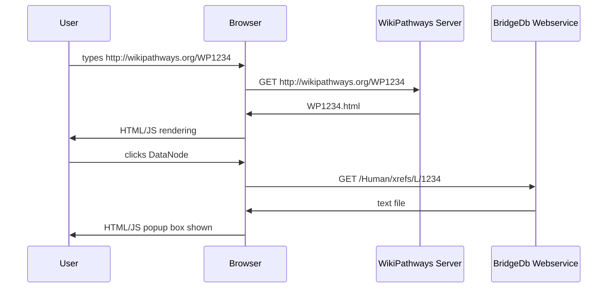

# WikiPathways Identifier Mapping

## WikiPathways and the BridgeDb Webservice

How a WikiPathways visitor uses the [BridgeDb Webservice](webservice.md):

```mermaid
sequenceDiagram
    participant User
    participant Browser
    participant WikiPathways Server
    participant BridgeDb Webservice
    User->>Browser: types http://wikipathways.org/WP1234
    Browser->>WikiPathways Server: GET http://wikipathways.org/WP1234
    WikiPathways Server->>Browser: WP1234.html
    Browser->>User: HTML/JS rendering
    User->>Browser: clicks DataNode
    Browser->>BridgeDb Webservice: GET /Human/xrefs/L/1234
    BridgeDb Webservice->>Browser: text file
    Browser->>User: HTML/JS popup box shown
```

