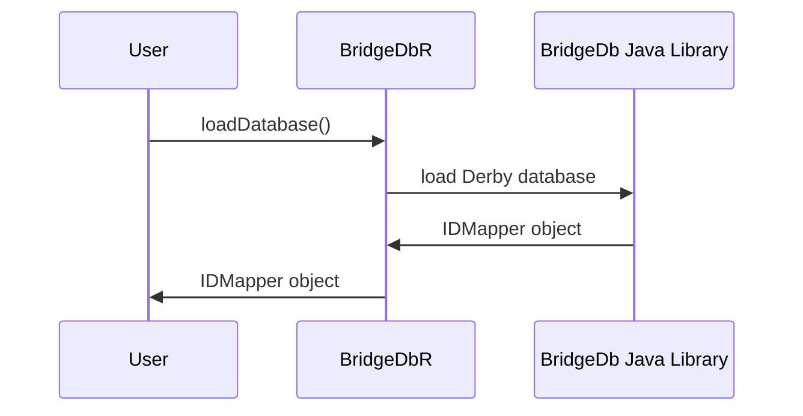

# BridgeDb R package

The R package is available from Bioconductor: https://bioconductor.org/packages/release/bioc/html/BridgeDbR.html

## Architecture

```mermaid
sequenceDiagram
    participant User
    participant BridgeDbR
    participant BridgeDb Java Library
    User->>BridgeDbR: loadDatabase()
    BridgeDbR->>BridgeDb Java Library: load Derby database
    BridgeDb Java Library->>BridgeDbR: IDMapper object
    BridgeDbR->>User: IDMapper object
```
