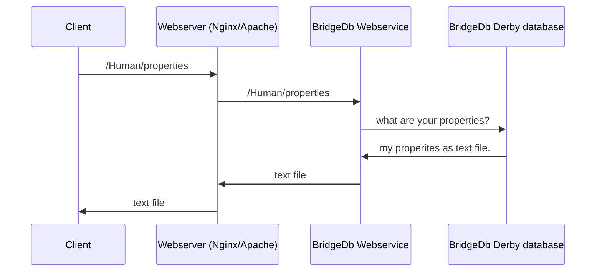
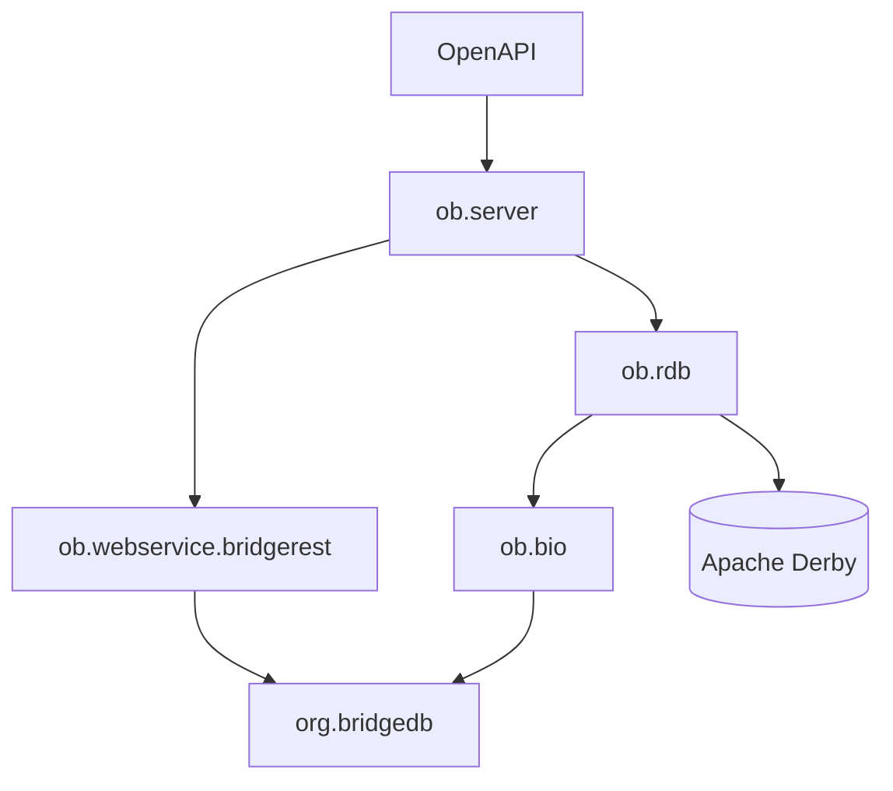

# BridgeDb Webservice

## A webservice call

```mermaid
sequenceDiagram
    participant Client
    participant Webserver (Nginx/Apache)
    participant BridgeDb Webservice
    participant BridgeDb Derby database
    Client->>Webserver (Nginx/Apache): /Human/properties
    Webserver (Nginx/Apache)->>BridgeDb Webservice: /Human/properties
    BridgeDb Webservice->>BridgeDb Derby database: what are your properties?
    BridgeDb Derby database->>BridgeDb Webservice: my properites as text file.
    BridgeDb Webservice->>Webserver (Nginx/Apache): text file
    Webserver (Nginx/Apache)->>Client: text file
```

## Architecture

```mermaid
graph TD;
    OpenAPI-->ob.server;
    ob.server-->ob.rdb;
    ob.server-->ob.webservice.bridgerest;
    ob.rdb-->ob.bio;
    ob.rdb-->Derby[(Apache Derby)];
    ob.webservice.bridgerest-->org.bridgedb;
    ob.bio-->org.bridgedb;
```
