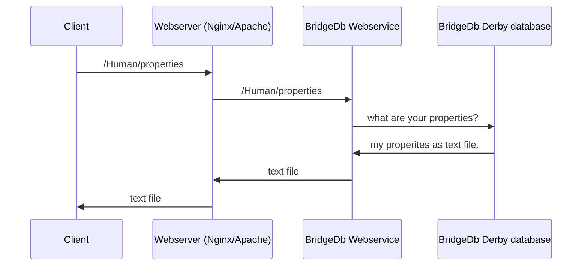
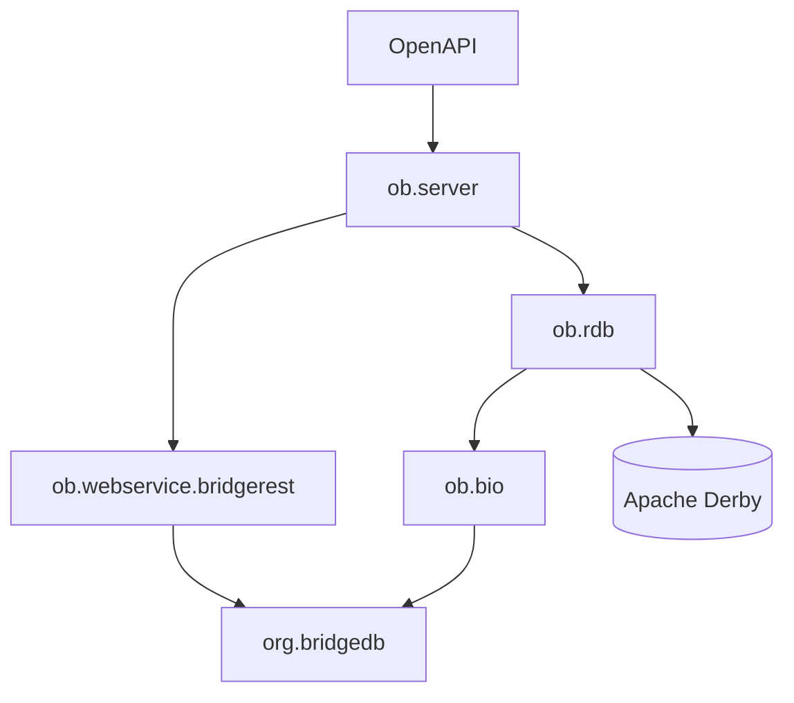
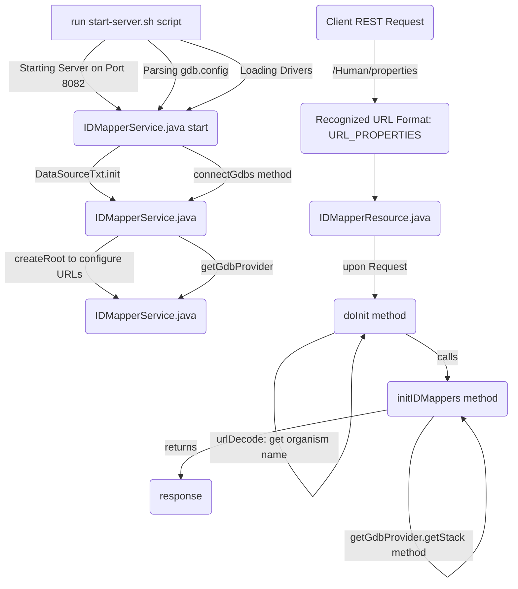

# BridgeDb Webservice

## A webservice call

```mermaid
sequenceDiagram
    participant Client
    participant Webserver (Nginx/Apache)
    participant BridgeDb Webservice
    participant BridgeDb Derby database
    Client->>Webserver (Nginx/Apache): /Human/properties
    Webserver (Nginx/Apache)->>BridgeDb Webservice: /Human/properties
    BridgeDb Webservice->>BridgeDb Derby database: what are your properties?
    BridgeDb Derby database->>BridgeDb Webservice: my properites as text file.
    BridgeDb Webservice->>Webserver (Nginx/Apache): text file
    Webserver (Nginx/Apache)->>Client: text file
```

## Architecture

```mermaid
graph TD;
    OpenAPI-->ob.server;
    ob.server-->ob.rdb;
    ob.server-->ob.webservice.bridgerest;
    ob.rdb-->ob.bio;
    ob.rdb-->Derby[(Apache Derby)];
    ob.webservice.bridgerest-->org.bridgedb;
    ob.bio-->org.bridgedb;
```
## A webservice call: Example

```mermaid
graph TD;
    A[run start-server.sh script] -->|Starting Server on Port 8082| B(IDMapperService.java)
    A[run start-server.sh script] -->|Parsing gdb.config| B(IDMapperService.java)
    A[run start-server.sh script] -->|Loading Drivers| B(IDMapperService.java)
    B(IDMapperService.java start) -->|DataSourceTxt.init| C(IDMapperService.java)
    B(IDMapperService.java start) -->|connectGdbs method| C(IDMapperService.java)
    C(IDMapperService.java) -->|createRoot to configure URLs| D(IDMapperService.java)
    C(IDMapperService.java) -->|getGdbProvider| D(IDMapperService.java)
    E(Client REST Request) -->|/Human/properties| F(Recognized URL Format: URL_PROPERTIES)
    F(Recognized URL Format: URL_PROPERTIES) --> G(IDMapperResource.java)
    G(IDMapperResource.java) -->|upon Request| H(doInit method)
    H(doInit method) --> |urlDecode: get organism name| H(doInit method)
    H(doInit method) -->|calls| J(initIDMappers method)
    J(initIDMappers method) -->|getGdbProvider.getStack method| J(initIDMappers method)
    J(initIDMappers method) -->|returns| K(response)
```